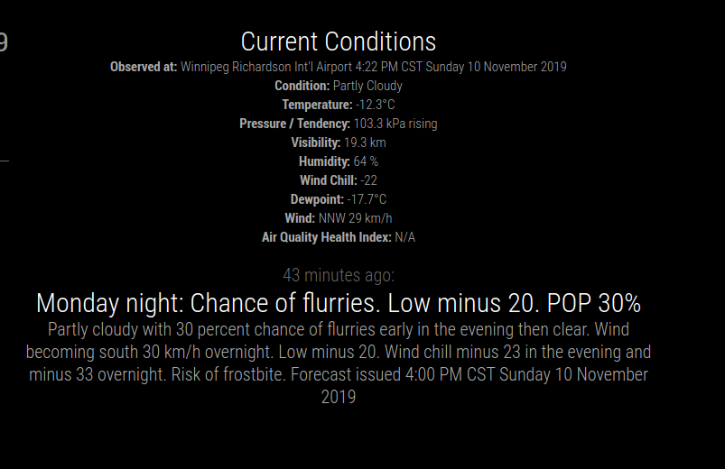

# Module: envcan
This module displays weather forecast based on an RSS feed. Scrolling 
through forecast entries happens time-based (````updateInterval````), 
but can also be controlled by sending news feed specific notifications 
to the module.

This module is built upon the default newsfeed module from MagicMirror
written by Michael Teeuw http://michaelteeuw.nl

The numeric code for your Canadian city can be found by choosing your
city forecast from https://weather.gc.ca/canada_e.html, and then copying
the "Follow Weather" RSS link and placing it in your config.js file as 
shown below.

## Screenshot


## Using the module

### Configuration
To use this module, add it to the modules array in the `config/config.js` file:
````javascript
modules: [
		{
			module: "MMM-envcan",
			position: "top_center",
			config: {
				feeds: [
					{
						title: "EnvCan Winnipeg",
						url: "https://weather.gc.ca/rss/city/mb-38_e.xml"
					}
				],
				showSourceTitle: false,
				showPublishDate: true,
				showDescription: true,
				wrapDescription: true,
				maxNewsItems: 6,
				reloadInterval: 900000 // 15 minutes
			}
		},
]
````

### Notifications
#### Interacting with the module
MagicMirror's [notification mechanism](https://github.com/MichMich/MagicMirror/tree/master/modules#thissendnotificationnotification-payload) allows to send notifications to the `newsfeed` module. The following notifications are supported:

| Notification Identifier | Description
| ----------------------- | -----------
| `ARTICLE_NEXT`          | Shows the next news title (hiding the summary or previously fully displayed article)
| `ARTICLE_PREVIOUS`      | Shows the previous news title (hiding the summary or previously fully displayed article)
| `ARTICLE_MORE_DETAILS`  | When received the _first time_, shows the corresponding description of the currently displayed news title. <br> The module expects that the module's configuration option `showDescription` is set to `false` (default value). <br><br> When received a _second consecutive time_, shows the full news article in an IFRAME. <br> This requires that the news page can be embedded in an IFRAME, e.g. doesn't have the HTTP response header [X-Frame-Options](https://developer.mozilla.org/en-US/docs/Web/HTTP/Headers/X-Frame-Options) set to e.g. `DENY`.<br><br>When received the _next consecutive times_, reloads the page and scrolls down by `scrollLength` pixels to paginate through the article.
| `ARTICLE_LESS_DETAILS`  | Hides the summary or full news article and only displays the news title of the currently viewed news item.
| `ARTICLE_TOGGLE_FULL`   | Toogles article in fullscreen.

Note the payload of the sent notification event is ignored.

#### Example
The following example shows how the next news article title can be displayed on the MagicMirror.
````javascript
this.sendNotification('ARTICLE_NEXT');
````

#### `newsfeed` specific notification emitting modules
The third party [MMM-Gestures](https://github.com/thobach/MMM-Gestures) module supports above notifications when moving your hand up, down, left or right in front of a gesture sensor attached to the MagicMirror. See module's readme for more details.

## Configuration options

The following properties can be configured:

| Option             | Description
| ------------------ | -----------
| `feeds`            | An array of feed urls that will be used as source. <br> More info about this object can be found below. <br> **Default value:** `[{ title: "New York Times", url: "http://www.nytimes.com/services/xml/rss/nyt/HomePage.xml", encoding: "UTF-8" }]`<br>You can add `reloadInterval` option to set particular reloadInterval to a feed.
| `showSourceTitle`  | Display the title of the source. <br><br> **Possible values:** `true` or `false` <br> **Default value:** `true`
| `showPublishDate`  | Display the publish date of an headline. <br><br> **Possible values:** `true` or `false` <br> **Default value:** `true`
| `showDescription`  | Display the description of an item. <br><br> **Possible values:** `true` or `false` <br> **Default value:** `false`
| `wrapTitle`        | Wrap the title of the item to multiple lines. <br><br> **Possible values:** `true` or `false` <br> **Default value:** `true`
| `wrapDescription`  | Wrap the description of the item to multiple lines. <br><br> **Possible values:** `true` or `false` <br> **Default value:** `true`
| `truncDescription` | Truncate description? <br><br> **Possible values:** `true` or `false` <br> **Default value:** `true`
| `lengthDescription`| How many characters to be displayed for a truncated description? <br><br> **Possible values:** `1` - `500` <br> **Default value:** `400`
| `hideLoading`      | Hide module instead of showing LOADING status. <br><br> **Possible values:** `true` or `false` <br> **Default value:** `false`
| `reloadInterval`   | How often does the content needs to be fetched? (Milliseconds) <br><br> **Possible values:** `1000` - `86400000` <br> **Default value:** `300000` (5 minutes)
| `updateInterval`   | How often do you want to display a new headline? (Milliseconds) <br><br> **Possible values:**`1000` - `60000` <br> **Default value:** `10000` (10 seconds)
| `animationSpeed`   | Speed of the update animation. (Milliseconds) <br><br> **Possible values:**`0` - `5000` <br> **Default value:** `2500` (2.5 seconds)
| `maxNewsItems`     | Total amount of news items to cycle through. (0 for unlimited) <br><br> **Possible values:**`0` - `...` <br> **Default value:** `0`
| `ignoreOldItems`   | Ignore news items that are outdated. <br><br> **Possible values:**`true` or `false` <br> **Default value:** `false`
| `ignoreOlderThan`  | How old should news items be before they are considered outdated? (Milliseconds) <br><br> **Possible values:**`1` - `...` <br> **Default value:** `86400000` (1 day)
| `removeStartTags`  | Some newsfeeds feature tags at the **beginning** of their titles or descriptions, such as _[VIDEO]_. This setting allows for the removal of specified tags from the beginning of an item's description and/or title. <br><br> **Possible values:**`'title'`, `'description'`, `'both'`
| `startTags`        | List the tags you would like to have removed at the beginning of the feed item <br><br> **Possible values:** `['TAG']` or `['TAG1','TAG2',...]`
| `removeEndTags`    | Remove specified tags from the **end** of an item's description and/or title. <br><br> **Possible values:**`'title'`, `'description'`, `'both'`
| `endTags`          | List the tags you would like to have removed at the end of the feed item <br><br> **Possible values:** `['TAG']` or `['TAG1','TAG2',...]`
| `prohibitedWords` | Remove news feed item if one of these words is found anywhere in the title (case insensitive and greedy matching) <br><br> **Possible values:** `['word']` or `['word1','word2',...]`
| `scrollLength` | Scrolls the full news article page by a given number of pixels when a `ARTICLE_MORE_DETAILS` notification is received and the full news article is already displayed.<br><br> **Possible values:** `1` or `10000` <br> **Default value:** `500`
| `logFeedWarnings` | Log warnings when there is an error parsing a news article. <br><br> **Possible values:** `true` or `false` <br> **Default value:** `false`
| `stickyCurrentConditions` | Always keep the current conditions on top`
 
The `feeds` property contains an array with multiple objects. These objects have the following properties:

| Option     | Description
| ---------- | -----------
| `title`    | The name of the feed source to be displayed above the items. <br><br> This property is optional.
| `url`      | The url of the Atom feed used for the forecast. <br><br> **Example:** `'https://weather.gc.ca/rss/city/mb-38_e.xml'`
| `encoding` | The encoding of the news feed. <br><br> This property is optional. <br> **Possible values:**`'UTF-8'`, `'ISO-8859-1'`, etc ... <br> **Default value:** `'UTF-8'`

Feeds can be found on the https://weather.gc.ca site under the rss icon.  Here are the feeds for some Canadian cities:

| City | Feed URL
| ---- | --------
| St. John's | 'https://weather.gc.ca/rss/city/nl-24_e.xml'
| Halifax | 'https://weather.gc.ca/rss/city/ns-19_e.xml'
| Fredericton | 'https://weather.gc.ca/rss/city/nb-29_e.xml'
| Montreal | 'https://weather.gc.ca/rss/city/qc-147_e.xml'
| Quebec | 'https://weather.gc.ca/rss/city/qc-133_e.xml'
| Ottawa | 'https://weather.gc.ca/rss/city/on-118_e.xml'
| Toronto | 'https://weather.gc.ca/rss/city/on-143_e.xml'
| Thunder Bay | 'https://weather.gc.ca/rss/city/on-100_e.xml'
| Winnipeg | 'https://weather.gc.ca/rss/city/mb-38_e.xml' 
| Regina | 'https://weather.gc.ca/rss/city/sk-32_e.xml'
| Saskatoon | 'https://weather.gc.ca/rss/city/sk-40_e.xml'
| Calgary | 'https://weather.gc.ca/rss/city/ab-52_e.xml'
| Edmonton | 'https://weather.gc.ca/rss/city/ab-50_e.xml'
| Vancouver | 'https://weather.gc.ca/rss/city/bc-74_e.xml'
| Victoria | 'https://weather.gc.ca/rss/city/bc-85_e.xml'
